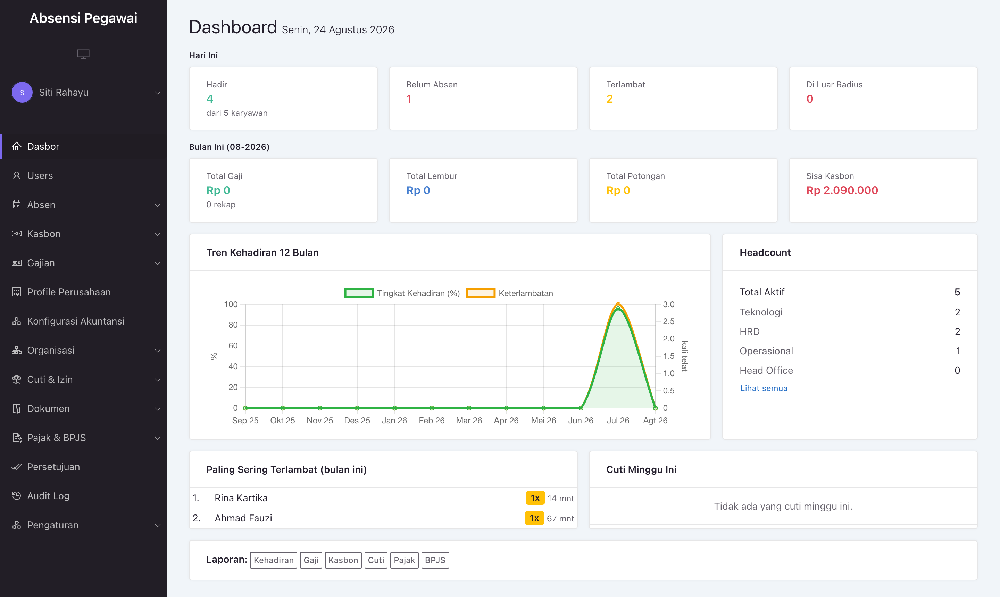

<h1 align="center">RitmeHR — Aplikasi Absensi & HRIS Indonesia</h1>

<p align="center">
  <strong>Absensi QR, penggajian otomatis, PPh 21 & BPJS, cuti, kasbon, dan portal karyawan — dalam satu aplikasi.</strong><br>
  Software HR & payroll siap pakai untuk UMKM dan perusahaan di Indonesia, dibangun dengan Laravel.
</p>

<p align="center">
  
  
  
  
  
  
  
</p>

---

**RitmeHR** adalah sistem **absensi berbasis pemindaian QR** yang berkembang menjadi
**HRIS (Human Resource Information System) lengkap**: penggajian otomatis, cuti,
kasbon, dokumen karyawan, pajak **PPh 21** & **BPJS**, rekrutmen, kinerja,
akuntansi internal, serta portal layanan mandiri karyawan.

Cocok sebagai **aplikasi absensi karyawan**, **software payroll Indonesia**, dan
**sistem HR** untuk UMKM hingga perusahaan multi-cabang — self-hosted, open source,
tanpa biaya lisensi per pengguna.

Dibangun dengan Laravel 12 dan Backpack CRUD 6 (edisi gratis) di atas MySQL 8.

**Dokumentasi:** [Panduan Pengguna](docs/PANDUAN-PENGGUNA.md) ·
[Panduan Developer](docs/PANDUAN-DEVELOPER.md)

---

## Daftar isi

- [Fitur](#fitur)
- [Tampilan](#tampilan)
- [Prasyarat](#prasyarat)
- [Pemasangan](#pemasangan)
- [Cara pakai](#cara-pakai)
- [Pengembangan](#pengembangan)
- [Pengujian](#pengujian)
- [Dokumentasi](#dokumentasi)
- [Catatan penerapan](#catatan-penerapan)
- [Melaporkan bug](#melaporkan-bug)
- [Kontribusi](#kontribusi)
- [Lisensi](#lisensi)

---

## Fitur

| Modul | Cakupan |
|---|---|
| **Absensi** | Pemindaian QR di pintu masuk, geofence per cabang, jadwal kerja, hari libur nasional |
| **Penggajian** | Komponen gaji, lembur, denda keterlambatan, rekap bulanan, slip gaji PDF |
| **Kasbon** | Penerbitan kasbon, pencatatan cicilan, potongan otomatis dari gaji |
| **Cuti & Izin** | Pengajuan, kuota tahunan dengan carry-over, kalender, rekap |
| **Persetujuan** | Alur bertingkat per modul; approver berdasarkan peran, atasan, atau user tertentu |
| **Organisasi** | Cabang, departemen bersarang, jabatan, bagan struktur |
| **Dokumen** | Dokumen karyawan di penyimpanan privat, checklist kelengkapan, peringatan kedaluwarsa |
| **Pajak & BPJS** | PPh 21 progresif, PTKP, BPJS Kesehatan/JHT/JP/JKK/JKM, THR |
| **Rekrutmen** | Lowongan, portal karier, pelamar, CV, wawancara, peringkat kandidat |
| **Kinerja** | Siklus review, KPI, item penilaian |
| **Akuntansi** | Bagan akun, jurnal, buku besar (opsional, `ACC_ACTIVE=true`) |
| **Portal Karyawan** | Riwayat kehadiran, slip gaji, cuti, kasbon, profil, notifikasi |
| **Dashboard & Laporan** | Ringkasan harian, tren 12 bulan, laporan kehadiran/gaji/kasbon/headcount |
| **Onboarding & Import** | Setup wizard 4 langkah untuk instance baru; import karyawan & gaji dari Excel |
| **Audit & Notifikasi** | Jejak audit seluruh perubahan; kanal database, email, dan WhatsApp |

Hak akses dibagi empat peran — `super_admin`, `hr_admin`, `manager`, `employee`
— dan ditegakkan di dua lapis: middleware pada route group, serta pembatasan
operasi di controller. Manager hanya melihat bawahan langsungnya.

---

## Tampilan

### Dashboard admin


Dashboard admin dengan data demo pada sebuah hari kerja: kehadiran hari ini,
tren 12 bulan, headcount per departemen, dan daftar keterlambatan.

Kartu penggajian menunjukkan Rp 0 karena tangkapan layar ini diambil di
pertengahan bulan — rekap gaji mengukur satu bulan penuh, sehingga baru terisi
setelah perhitungan bulanan dijalankan. Perilaku ini disengaja, bukan kekosongan
data.

---

## Prasyarat

| Kebutuhan | Versi |
|---|---|
| PHP | 8.1 atau lebih baru (diuji pada 8.2) |
| Composer | 2.x |
| Docker | untuk MySQL 8 |
| Node.js | 18+ — hanya bila menjalankan pengujian browser |

Ekstensi PHP yang dibutuhkan mengikuti kebutuhan standar Laravel 12, ditambah
`gd` untuk pembuatan QR dan kartu karyawan.

---

## Pemasangan

```bash
git clone git@github.com:agitnaeta/ritmehr.git
cd ritmehr

composer install
cp .env.example .env
php artisan key:generate

npm install && npm run build     # wajib — stylesheet dimuat lewat Vite
```

> `npm run build` **bukan opsional.** Panel admin dan portal karyawan memuat
> stylesheet-nya lewat Vite, sedangkan `public/build` tidak disertakan dalam
> repositori. Tanpa langkah ini, halaman akan tampil tanpa gaya atau melempar
> galat manifest. Jalankan ulang setiap kali berkas di `resources/css/` diubah,
> atau pakai `npm run dev` saat sedang mengerjakannya.

Jalankan basis data, lalu sesuaikan `.env`:

```bash
docker compose up -d          # MySQL 8 pada port host 3307
```

```env
DB_CONNECTION=mysql
DB_HOST=127.0.0.1
DB_PORT=3307
DB_DATABASE=absensi
DB_USERNAME=root
DB_PASSWORD=secret
```

> `.env.example` mengirim `DB_PORT=3306`, sedangkan `docker-compose.yml`
> memetakan MySQL ke **3307** supaya tidak bentrok dengan MySQL lokal. Ubah
> manual setelah menyalin.

Siapkan skema dan data referensi:

```bash
php artisan migrate
php artisan db:seed --class=HrisSeeder      # peran, izin, alur persetujuan, tarif pajak
php artisan serve
```

`HrisSeeder` bersifat idempoten — aman dijalankan ulang setelah pembaruan.

Berikan peran tertinggi ke akun pertama:

```bash
php artisan tinker
>>> \App\Models\User::find(1)->assignRole('super_admin');
```

---

## Cara pakai

Aplikasi punya tiga pintu masuk:

| Alamat | Untuk siapa | Perlu login |
|---|---|---|
| `/scan` | Pemindai QR di pintu masuk kantor | tidak |
| `/admin/login` | HR, manager, super admin | ya |
| `/my` | Karyawan — portal layanan mandiri | ya |

Membuka `/` akan mengarahkan ke `/scan`.

Untuk instance yang benar-benar baru, buka **`/admin/setup`** — Setup Wizard
memandu empat langkah: profil perusahaan, departemen & cabang, akun admin,
lalu import karyawan dari Excel. Dashboard juga menampilkan checklist "Mulai di
sini" selama data inti belum lengkap.

Alur harian paling umum: karyawan menunjukkan QR di kartunya ke kamera pada
halaman `/scan`. Pemindaian pertama tercatat sebagai jam masuk, berikutnya
sebagai jam keluar. Keterlambatan, lembur, dan pemeriksaan lokasi dihitung
otomatis.

Untuk tugas selengkapnya — menambah karyawan, menjalankan penggajian,
menyetujui cuti, mengelola kuota — lihat
**[Panduan Pengguna](docs/PANDUAN-PENGGUNA.md)** yang disusun per peran.

### Data demo

```bash
php artisan db:seed --class=DemoDataSeeder   # menolak berjalan di production
```

Membuat perusahaan lima orang dengan satu bulan kehadiran penuh, cuti yang sudah
disetujui dan yang masih menunggu, satu kasbon, serta satu siklus penggajian.

| Email | Password | Peran |
|---|---|---|
| `siti@demo.test` | `password` | super_admin |
| `rina@demo.test` | `password` | hr_admin |
| `budi@demo.test` | `password` | manager |
| `ahmad@demo.test`, `dewi@demo.test` | `password` | employee |

Data sengaja ditempatkan di **bulan sebelumnya**: rekap gaji mengukur satu bulan
penuh, sehingga bulan berjalan yang baru separuh akan terbaca seperti absen
massal.

---

## Pengembangan

Struktur kode mengikuti satu aturan utama: **logika bisnis berada di Service,
bukan di controller.** Controller Backpack hanya mengatur field, kolom, dan hak
akses.

```
app/
├── Http/Controllers/Admin/     37 CRUD controller
├── Http/Controllers/Portal/    seluruh /my/*
├── Services/                   aturan bisnis sesungguhnya
├── Observers/                  perhitungan turunan presensi & gaji
└── Traits/                     Auditable, HasApproval, HasSimpleFilters
```

Sebelum menyentuh kode, baca bagian **empat jebakan** di
**[Panduan Developer](docs/PANDUAN-DEVELOPER.md)**. Ringkasnya:

1. Backpack memakai guard `backpack`, sedangkan peran Spatie tersimpan di guard
   `web` — sehingga `@can` dan `@role` bawaan **selalu false** untuk admin
2. Model CRUD wajib memakai `CrudTrait`, karena itu `Role` dan `Permission`
   punya pembungkus lokal
3. `addFilter()` berbayar di edisi gratis; penggantinya trait `HasSimpleFilters`
4. Baris tabel dimuat lewat AJAX, dan `recordsTotal` bukan angka yang
   ditampilkan — `recordsFiltered` yang benar

### Perintah artisan

| Perintah | Fungsi | Jadwal |
|---|---|---|
| `notify:attendance --type=checkin` | Belum absen masuk | hari kerja 08:15 |
| `notify:attendance --type=late` | Terlambat | hari kerja 09:30 |
| `notify:attendance --type=checkout` | Belum absen keluar | hari kerja 17:00 |
| `documents:notify-expiring --days=30` | Dokumen mendekati kedaluwarsa | Senin 07:30 |
| `notify:approval-digest` | Ringkasan persetujuan tertunda | Senin 08:00 |
| `backup:run --only-db` | Cadangan basis data | harian 23:00 |
| `db:seed RecalculatePresence` | Hitung ulang presensi | harian 23:30 |
| `audit:prune --days=90` | Pangkas jejak audit | bulanan tgl 1, 02:00 |
| `leave:generate-balances --carry-over --max-carry=6` | Saldo cuti tahunan | tahunan |
| `calculate:salary` | Hitung rekap gaji | manual |
| `salary:recalculate` | Hitung ulang gaji per user/bulan | manual |
| `import:presence-command` | Impor presensi (CLI) | manual |

Import karyawan & struktur gaji dari Excel tersedia lewat UI (tombol **Import
Excel** di daftar Users dan Gaji), lengkap dengan template dan pratinjau
validasi. Instance baru bisa memakai **Setup Wizard** di `/admin/setup`.

Penjadwalan berjalan lewat `php artisan schedule:work` atau cron. Log aplikasi
bisa dibaca di `/log-viewer`.

---

## Pengujian

Dua lapis, keduanya perlu dijalankan sebelum rilis.

```bash
./vendor/bin/phpunit
```

403 test pada skema `absensi_testing` yang terpisah, jadi tidak menyentuh data
pengembangan.

```bash
npm install && npx playwright install chromium
php artisan serve                       # aplikasi harus berjalan lebih dulu
node tests/browser/crud-suite.mjs       # 146 pemeriksaan CRUD & hak akses
node tests/browser/ui-test.mjs          # rendering dashboard, menu, portal
```

Pengujian browser menutup hal yang tidak terjangkau PHPUnit: tabel yang dimuat
lewat AJAX, rendering grafik, visibilitas menu per peran, dan route publik yang
diakses tanpa login.

> `crud-suite.mjs` **mengubah data**. Cadangkan lebih dulu:
> ```bash
> docker exec absensi-mysql mysqldump -uroot -psecret --single-transaction absensi \
>   > storage/app/backups/pre-crud-test.sql
> ```
> Pulihkan dengan `mysql` memakai berkas yang sama.

---

## Dokumentasi

Mulai dari salah satu ini, sesuai kebutuhanmu:

| Dokumen | Untuk siapa |
|---|---|
| **[Panduan Pengguna](docs/PANDUAN-PENGGUNA.md)** | HR, manager, karyawan. Berorientasi tugas, disusun per peran, dilengkapi tanya-jawab |
| **[Panduan Developer](docs/PANDUAN-DEVELOPER.md)** | Arsitektur, konvensi, jebakan yang perlu diketahui, cara menambah modul |

Rujukan lebih dalam:

| Dokumen | Isi |
|---|---|
| [HRIS_SETUP.md](docs/HRIS_SETUP.md) | Referensi modul dan keputusan arsitekturnya |
| [BUSINESS_FLOW.md](docs/BUSINESS_FLOW.md) | Alur bisnis |

---

## Catatan penerapan

**Tarif pajak wajib diverifikasi.** `TaxRateSeeder` mengacu PMK 101/2016 dan
UU HPP No. 7/2021 pada saat ditulis, dengan JKK kelas risiko terendah (0,24%).
PTKP, lapisan PPh 21, dan persentase BPJS disimpan **per tahun** supaya
perhitungan historis memakai tarif periodenya sendiri. Periksa nilainya terhadap
regulasi terbaru sebelum menjalankan penggajian sungguhan.

**Aplikasi ini single-tenant.** Satu instalasi untuk satu perusahaan. Tabel
`branches` dan `departments` adalah struktur di dalam satu perusahaan, bukan
pemisah antar pelanggan; tidak ada kolom tenant di tabel inti.

**Dokumen karyawan** disimpan di disk `local` yang privat, bukan `public`.
Unduhan mengalir lewat aplikasi setelah pemeriksaan hak akses.

**WhatsApp** memakai `LogWhatsAppGateway` yang hanya mencatat, sampai
`FONNTE_TOKEN` diisi — supaya tidak ada notifikasi yang berpura-pura terkirim.

**Integrasi akuntansi** nonaktif kecuali `ACC_ACTIVE=true` diset di `.env`.

Daftar periksa lengkap sebelum rilis ada di
[Panduan Developer](docs/PANDUAN-DEVELOPER.md#sebelum-rilis).

---

## Melaporkan bug

Laporkan bug dan usulan fitur lewat **[GitHub Issues](https://github.com/agitnaeta/ritmehr/issues)**.

Agar laporannya bisa langsung ditindaklanjuti, sertakan:

| Yang dibutuhkan | Contoh |
|---|---|
| **Peran** saat kejadian | super_admin, hr_admin, manager, atau employee |
| **Halaman atau menu** | `/admin/salary-recap`, atau "Cuti & Izin → Saldo Cuti" |
| **Langkah** sampai muncul | "Buka Add, langsung klik Simpan tanpa mengisi apa pun" |
| **Yang terjadi** vs **yang diharapkan** | "Muncul layar 500" vs "Muncul pesan validasi di bawah field" |
| **Pesan galat**, bila ada | salin utuh, termasuk kode SQLSTATE |

Dua hal yang sangat membantu:

- **Sebutkan perannya.** Sebagian besar bug yang sudah ditemukan di proyek ini
  hanya muncul pada peran tertentu — beberapa hanya kelihatan sebagai manager,
  satu bahkan hanya muncul bagi pengunjung **tanpa login**.
- **Periksa dulu apakah memang bug.** Beberapa perilaku sering disalahartikan
  sebagai bug — misalnya kartu penggajian yang menunjukkan Rp 0 di pertengahan
  bulan, atau karyawan yang dialihkan dari `/admin` ke `/my`.

Bug yang sudah dikonfirmasi ditangani lewat GitHub Issues.

---

## Kontribusi

1. Buat branch dari `master`
2. Kalau menambah modul, ikuti urutan di
   [Panduan Developer](docs/PANDUAN-DEVELOPER.md#menambah-modul-crud-baru) —
   termasuk menambahkan izin di `RolesAndPermissionsSeeder`, langkah yang paling
   sering terlewat
3. Jalankan kedua lapis pengujian sampai hijau
4. Tulis pesan commit yang menjelaskan **mengapa**, bukan hanya apa

Bila perbaikanmu menutup sebuah bug, jelaskan di deskripsi PR: langkah
reproduksi, akar masalah bertautan ke `file:baris`, dan cara memverifikasinya.

---

## Lisensi

`composer.json` menyatakan **MIT**, warisan dari kerangka Laravel. Namun
repositori ini **belum memiliki berkas `LICENSE`**.

TODO: tambahkan berkas `LICENSE` yang sesuai, atau perbarui `composer.json` bila
proyek ini bersifat tertutup.
